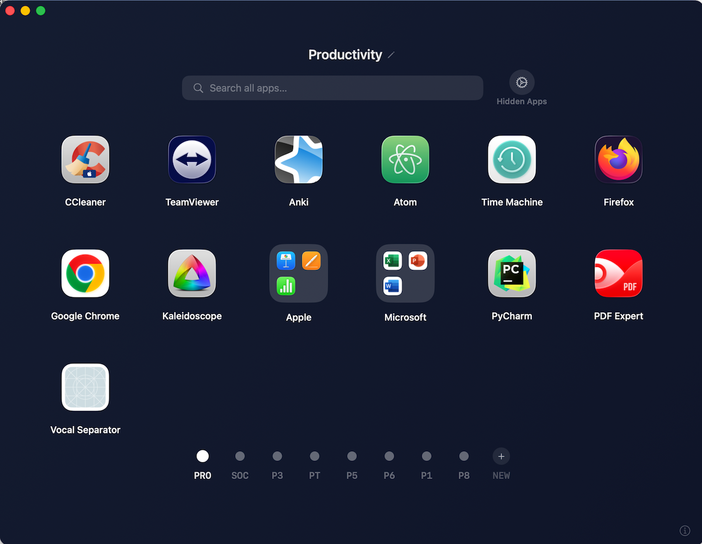

# AppShelf 🗂️

A clean, fast macOS app launcher — a better alternative to Launchpad.

## Features

- 📄 Organize apps into custom named pages
- 🔍 Search across all pages instantly
- 📁 Create folders by dragging one app onto another
- ↔️ Drag and drop to reorder apps anywhere
- 🗑️ Hide apps you don't need
- ♻️ Restore hidden apps anytime
- 💾 Layout saves automatically — survives restarts
- ⌨️ Arrow keys to navigate between pages
- 🔄 Rescan button — finds newly installed apps without losing your layout
- 📐 30 apps per page (6×5 grid)

## What's New in v1.3

- Fixed built-in macOS Utilities (Terminal, Disk Utility, System Information, Activity Monitor, Console, etc.) getting wrongly hidden by the junk-app filter
- AppShelf now hides itself the moment you launch an app — old Launchpad-style auto-dismiss
- Fixed a crash when dragging an app to another page
- Fixed the app becoming unresponsive (no jiggle, no tap-to-launch) after a few drag-and-drops into the same folder

## What's New in v1.1

- Fixed missing apps — now finds all apps including those in subfolders
- Fixed duplicate apps appearing multiple times
- Removed system utilities that don't belong in a launcher
- Fixed page abbreviations — now shows P01, P02... correctly
- Added rescan button (↺) at bottom left to find newly installed apps
- Increased apps per page from 18 to 30 (6×5 grid)

## Install

1. Download `AppShelf.zip` from [Releases](../../releases)
2. Unzip and drag `AppShelf.app` to your `/Applications` folder
3. First launch: right-click `AppShelf` → **Open** → click **Open**
4. Auto-start on login: **System Settings → General → Login Items → +** → select AppShelf

## Requirements

- macOS 13 or later
- Apple Silicon or Intel Mac

## How to Use

| Action | How |
|--------|-----|
| Launch app | Single click |
| Enter edit mode | Long press anywhere |
| Reorder apps | Drag and drop |
| Create folder | Enter edit mode → drag app onto another |
| Move app to another page | Drag app onto page dot |
| Hide app | Edit mode → tap × |
| Restore hidden app | Gear icon → click app |
| Rename page | Click pencil next to page title |
| New page | Click + next to page dots |
| Rescan for new apps | Click ↺ button (bottom left) |

## Build from Source

1. Clone this repo
2. Open `AppShelf.xcodeproj` in Xcode
3. Press ⌘R to build and run

## License

MIT — free to use and modify.
